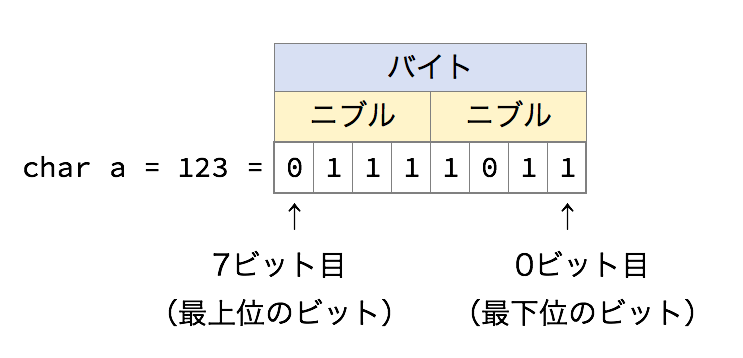

コンピューターの基本原理
====

プログラミング言語がコンピューターと話すための言葉であるならば、コンピューターがどのように動いているかを知ることは、私たちが外国の人々の文化や生活を知ることと全く同じです。
コンピュータにとっての世界は私たちのいる世界と少しかけ離れていますが、とても単純で整った世界です。理解することは難しくありません。
逆に言えばコンピューターの世界のことを知らなければ、「彼ら」に私たちの意思を伝えることは難しいでしょう。

というわけで、これからコンピューターの世界の「常識」を一つずつ見てゆくことにします。

### そこにあるのは0と1だけだった…
私たちの世界では、すべての物質はある決まった数の元素の組み合わせで成り立っています。これと全く同様に、コンピューターの世界にも「元素」というべきものが存在します。
それが、「0と1」です。

本当に0と1だけしかないの？と思われるかもしれませんが、残念ながら本当に0と1しかありません。しかし、この2種類の元素の組み合わせだけで、コンピューターはあらゆる情報を表現できるのです。

### 0と1の組み合わせ。それが2進法
さて、0と1の組み合わせであらゆる情報を表現できるといいましたが、一体どのような情報を表現できるのでしょうか。
それを確かめるために、まずは0と1を4つ組み合わせると何ができるか見てみましょう。
```
00 01 10 11
```
0と1を順番を考慮して組み合わせると、上記のように4つの「もの」を作ることができます。
それでは、0と1を4つ組み合わせるとどうなるでしょうか。
```
0000 0001 0010 0011 0100 0101 0110 0111 1000 1001 1010 1011 1100 1101 1110 1111
```
今度は16この「もの」をつくることができました。
これらの例から、0と1をいくつか組み合わせることで複数の状態を表すことができる、ということがわかります。

…とまあ長々説明してきましたが、このあたりはもう定義なので、おとなしく定義を書くことにしましょう。
10進法と2進法の対応は、以下のようになっています。

<table class="table table-bordered table-striped">
<tr><th>2進法</th><th>10進法</th><th>16進法</th></tr>
<tr><td>0</td><td>0</td><td>0</td></tr>
<tr><td>1</td><td>1</td><td>1</td></tr>
<tr><td>10</td><td>2</td><td>2</td></tr>
<tr><td>11</td><td>3</td><td>3</td></tr>
<tr><td>100</td><td>4</td><td>4</td></tr>
<tr><td>101</td><td>5</td><td>5</td></tr>
<tr><td>110</td><td>6</td><td>6</td></tr>
<tr><td>111</td><td>7</td><td>7</td></tr>
<tr><td>1000</td><td>8</td><td>8</td></tr>
<tr><td>1001</td><td>9</td><td>9</td></tr>
<tr><td>1010</td><td>10</td><td>A</td></tr>
<tr><td>1011</td><td>11</td><td>B</td></tr>
<tr><td>1100</td><td>12</td><td>C</td></tr>
<tr><td>1101</td><td>13</td><td>D</td></tr>
<tr><td>1110</td><td>14</td><td>E</td></tr>
<tr><td>1111</td><td>15</td><td>F</td></tr>
</table>

どうでしょうか。理解できましたか？
それではまず、2進法から10進法へ変換する方法を確認しましょう。
普段の10進法では意識していませんが、10進法はn桁目(もっとも小さい位を0桁目とする)が<span>$10^n$</span>の重みを持っていると解釈できます。たとえば、10進法で123という数値は
$$ 123_{(10)} = 1 \times 10^2 + 2 \times 10^1 + 3 \times 10^0 $$
ということを表しているのです。
では、2進法で1111011は10進法でいくつなのでしょうか。
$$ 1 \times 2^6 + 1 \times 2^5 + 1 \times 2^4 + 1 \times 2^3 + 0 \times 2^2 + 1 \times 2^1 + 1 \times 2^0 = 123 $$
画面幅の狭い環境では数式が途切れているかもしれませんが、この結果は123です。そう、123という数値の二進法表記は1111011なのです。


ちなみにこの表には、16進法での表記も書かれています。2進法は普段使っている10進法に比べて表記桁数が多くなってしまうという欠点がありますが、16進法を使うことでその欠点を回避できます。
しかも16進法は、2進法との相互変換がきわめて容易であるという性質も持っています。

### 数値の大きさ
さて、コンピューターはすべての情報を数値としてあつかう、ということは分かってもらえたでしょうか。今度は、その数値には大きさがある、という話をします。
そのために、まずはいくつか言葉の説明をしようと思います。




まず、2進法で表記される数値のそれぞれの桁のことを「ビット」と言います。
基本的に、一番小さな位の桁（二進法でもっとも右端のビット）のことを「最下位のビット」もしくは「0ビット目」といい、一番大きな位の桁のことを「最上位ビット」と言います。
そして、ビットが4つ集まったものを「ニブル」と言います。これは、全世界いつの時代も共通の定義です。
次に「バイト」という言葉について説明します。そう、「8GBのUSBメモリ」とか言うときの「B」に相当するのが、バイトです。
現代の主なコンピューターでは、「1バイト=8ビット=2ニブル」という定義が広く用いられています。昔は、1バイトが7ビットだったり16ビットだったりするコンピューターもあたのですが、皆さんが触れる機会はしばらく（ずっと？）ないと思いますので、今は忘れる事にします。

ここまでの説明で「1バイト=8ビット」ということが分かってもらえれば、ひとまず大丈夫です。

なぜ「バイト」の説明をしたかというと、これから説明する「メモリ」は、この「バイト」を基準に作られているからです。
では、さっそくメモリとは何かをみていきましょう。

### メモリ～住所（アドレス）のついたバイト列～
先に説明したとおり、メモリはコンピューターがデータを格納するための場所です。
ここには、図にあるとおり、たくさんのバイトが並んでいます。ですが、これだけでは「メモリ」とは言えません。
なぜなら、「どのデータがどこにあるのかわからない」からです。たとえば、図の中で「34」が入ったバイトはどこか、と聞かれたら、人間なら「12の下にある」と答えるかもしれませんが、コンピューターにはそもそも12がどこにあるのか分からないのです。
ということで、これらのたくさんあるバイト一つ一つに住所（アドレス）をつけることにしましょう。当然のことながら、コンピューターは数値しか分からないので、アドレスも数値です。
そうすることで、「34の入ったバイトはどこか」をコンピューターに伝えたいときには、「アドレスが3の場所」と言えばいいことになります。

これがメモリの基本的な概念です。

### 変数はメモリ上の場所取り
それでは、メモリとC言語の関係をみていきたいと思います。
まず、C言語でもっとも基本的な要素といえば、変数があります。
変数は数値を保存しておくものですから、当然メモリのどこかにあるわけです。
ではまず、以下のプログラムについて考えてみましょう。
<pre class="brush: c">
int main(void)
{
	char a, b, c;
	a = 32;
	b = 15;
	c = 0;
}
</pre>
このプログラム中にある変数a, b, cは、char型で宣言されています。
以下に、C言語における変数の型とその占めるバイト数を示しておきます。
<table class="table">
<tr><th>型</th><td>char</td><td>short</td><td>int</td><td>int</td><td>int</td></tr>
<tr><th>バイト数</th><td>1</td><td>2</td><td>4</td><td>4</td><td>8</td></tr>
</table>
ちなみに、先ほど「バイト」の説明の際に言ったことと同様に、C言語における変数の大きさは、時代や環境によって異なる場合がありました。現在はほとんどのコンピューターで上記の値が採用されていますが、必ずしもそうではないということを頭の片隅に入れておくとよいと思います。


（続く…）
