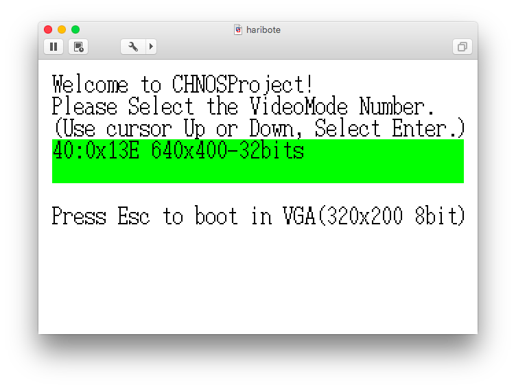
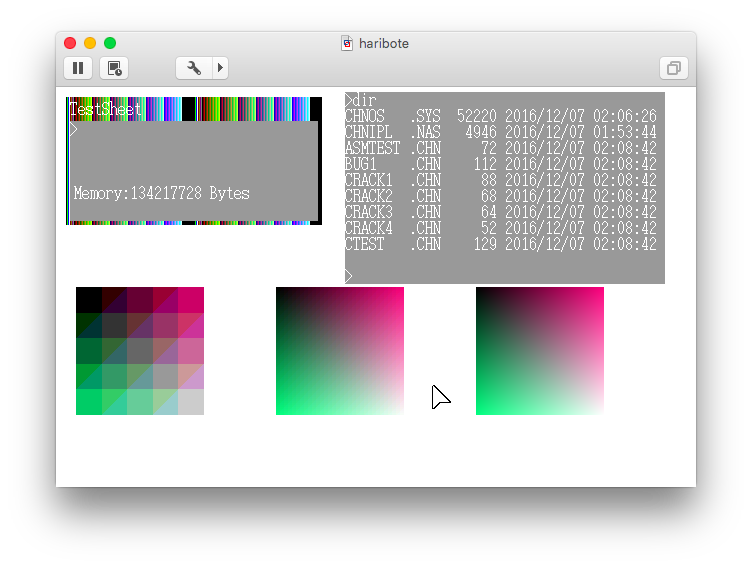
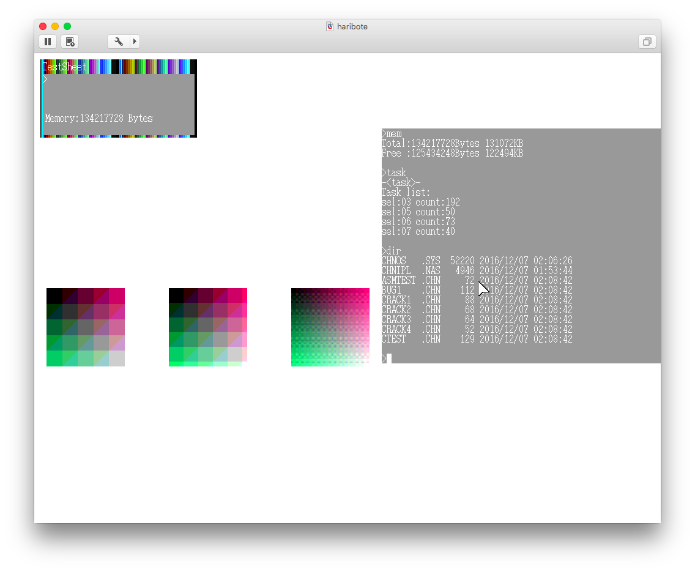

## 仮想86モードでBIOSを呼び出した話

- この記事は、[自作OS Advent Calendar 2016](http://www.adventar.org/calendars/1666)の一部として作成されました。

- 大昔の私が、若気の至り(?)で無理やりBIOSを仮想86モードを介して呼び出したという話です。UEFI全盛となった現代では全く役に立たないことをご承知の上お読みください（涙）。

### 背景
私はその頃、はりぼてOSベースの自作OSの多色対応に取り組んでいて、様々なビット数のモードで描画するための関数群を整備していました。
しかし、はりぼてOSにおける画面モードは、`asmhead.nas`の中で設定されており、変更を反映するためには毎回コンパイルし直さなければなりませんでした。
せっかく多色対応をしても、画面モードが起動時に決め打ちだと、デバッグするたびに再起動しないといけませんし、そもそも多色対応したのだから、起動した後に画面モードを切り替えるということもやってみたいです。

しかし、そもそもなぜ`asmhead.nas`で画面モードが設定されているのかというと、画面モードはBIOSを介して設定されており、そのBIOSは16ビットコードで書かれているためです。つまり、32ビットからは呼べません。

そうなると、普通は「じゃあ32ビットでドライバ書くか」という方向に普通ならなるわけですが、私の頭の中には、あのとんでもないページ数の「インテル・アーキテクチャ・ソフトウエア・デベロッパーズ・マニュアル」にある1ページが浮かんできました。

(日本語版ならば資料番号253668-013Jの第16章 8086エミュレーション)

(英語版ならば資料番号325384 CHAPTER 20 8086 EMULATION)

…そうです！仮想86モードです！

### 仮想86モードってなに？

仮想86モードは、32ビットプロテクトモードにおけるタスクの動作モードの一つで、8086プロセッサ、つまり16ビットモードの動作をCPUが完全にエミュレーションしてくれるモードです。

仮想86モードで動作しているか否かは、EFLAGSレジスタのVMEフラグで設定・確認できます。

発生した例外や割り込みについては、仮想86モードモニタと呼ばれるプロテクトモードのタスクに制御を移すか、それとも仮想86モードで実行中のタスク内で完結させるかを、割り込み番号ごとに指定できます。

### で、どうやって使うの？
実はとっても簡単です。
ただただ新しいタスクを作り、そのEFLAGSのVMフラグを1にセットすればよいのです。

 > [chnos_010/chnos/callbios.c](https://github.com/hikalium/chnos/blob/master/tolset_chn_000/chnos_010/chnos/callbios.c)

````
//fifoには、終了状況を受け取るfifoを指定する。endsignalは正常終了、endsignal+1は異常終了を示す。
void CallBIOS_Execute(IO_CallBIOSControl *ctrl, uchar intn, DATA_FIFO32 *fifo, uint endsignal)
{
	uchar *q;

	ctrl->CallBIOS_Task->tss->eip = 0xc200;
	ctrl->CallBIOS_Task->tss->eflags.bit.VM = True;
	ctrl->CallBIOS_Task->tss->cs = 0;
	ctrl->CallBIOS_Task->tss->ss = 0;
	ctrl->CallBIOS_Task->tss->ds = 0;
	ctrl->CallBIOS_Task->tss->esp = 0xc200;

	ctrl->CallBIOS_Task->tss->esp0 = ctrl->esp0;

	ctrl->fifo = fifo;
	ctrl->endsignal = endsignal;

	q = (uchar *)0xc201;
	*q = intn;

	System_MultiTask_Task_Run(ctrl->CallBIOS_Task);

	return;
}
````
基本的にはこれで良いのですが、今回はCR4（コントロールレジスタ4）のVMEフラグも1にします。これにより、仮想86モードで発生したソフトウエア割り込みを、仮想86モードモニタを通さずに直接仮想86モード内の割り込みベクタで処理できるようになります。（詳細は例の仕様書を参照。）

 > [chnos_010/chnos/callbios.c](https://github.com/hikalium/chnos/blob/master/tolset_chn_000/chnos_010/chnos/callbios.c)

````
cr4.bit.VME = True;
````

ただし、ここからBIOSをうまく呼び出すためには、さらにいくつかのテクニックが必要となります。

#### まず、BIOSを呼び出すためのコードを用意する
今回の目的は、BIOSを呼び出すことでした。
そこで、まずはBIOSを呼び出す16ビットコードのひな形をつくる必要があります。
私のOSでは、以下のようなソースを`nasfunc2.nas`として用意しました。
> [chnos_010/chnos/nasfunc2.nas](https://github.com/hikalium/chnos/blob/master/tolset_chn_000/chnos_010/chnos/nasfunc2.nas)

````
[FORMAT "WCOFF"]
[INSTRSET "i486p"]
[BITS 16]
[FILE "nasfunc2.nas"]

	GLOBAL	_asm_16bit_CallBIOSTask

[SECTION .text]
_asm_16bit_CallBIOSTask:
	org	0xc200
_asm_16bit_CallBIOSTask_Code:
	int	0x0d
_asm_16bit_CallBIOSTask_Code_End:
	db	0x0f, 0x0b	;ud2
````

#### パラメータをどうやって渡すか
BIOSを呼び出す際に必要な情報は、割り込み番号と、EAXの値などのパラメータです。
EAXの値などのパラメータについては、仮想86モードのタスクを起動する前に、TSSの情報を直接書き換えてしまいます。

そして、割り込み番号については、なんとプログラムを直接書き換えてしまいます。
上記のプログラムは0xc200から配置されており、int命令は2バイト命令で、2バイト目に割り込み番号を指定します。
したがって、以下のようにすることで割り込み番号をintnに書き換えることができます。
````
	q = (uchar *)0xc201;
	*q = intn;
````

#### 呼び出しプログラムをどこに配置するか
上記のプログラムでは、プログラムの配置先を0xc200に設定しています。

これは、asmheadが読み込まれるアドレスで、OS起動後は使われない領域です。
16ビットモードではアクセスできるメモリアドレスが制限されるため、使用実績のあるこのアドレスを配置先に選びました。
（まあ相対JMP命令等を使用していないので、org擬似命令を書かなくても問題はないはずですが、一応書いてあります。）

#### いかにして終了を検出するか
上記のコードには、謎のバイト列が書かれた一行が存在します。
````
db  0x0f, 0x0b  ;ud2
````
これは、ud2命令（未定義命令）に相当するバイト列で、必ず「未定義オペコード例外」を発生するという、自己矛盾した命令です。naskにはこのニーモニックが登録されていなかったようなので、バイト列で直接書きました。
この未定義オペコード例外を仮想86モードモニタで捕捉することにより、上記プログラムの終了を検知しています。

#### ソフトウエア割り込みリダイレクトマップを設定する
BIOSの呼び出しには、ソフトウエア割り込みを使用します。このソフトウエア割り込みは、TSSの「ソフトウエア割り込みリダイレクトマップ」の設定により、仮想86モード内で処理するか、仮想86モードモニタに制御を移すかを指定できます。今回は、BIOSという16ビットコードをソフトウエア割り込みで呼び出したいため、すべてのビットを0にセットしました。

#### I/O許可ビットマップを設定する
仮想86モードタスクは、プロテクトモードの仕組みの中にあります。ですから、たとえ仮想86モード内の動作とはいえ、勝手にI/Oポートなどを読み書きされることは阻止できなければなりません。

このために存在するのが、I/O許可ビットマップで、これもTSSの中にあります。
今回は、実行するBIOSが一体どのI/Oポートにアクセスするか全く予想できないため、すべてのIOポートに対してのアクセスを許可するよう、すべてのビットを0に設定しました。

#### 仮想マシンモニタを例外ハンドラに登録する
仮想86モードを実行中のタスクで特権命令などが実行された場合は、例外0x0d(一般保護例外)が発生します。この例外を捕捉し、特権命令の動作をエミュレートすることで、仮想86モードを続行することができます。

> [chnos_010/chnos/xception.c](https://github.com/hikalium/chnos/blob/master/tolset_chn_000/chnos_010/chnos/xception.c)

````
void CPU_ExceptionHandler0d(uint *esp)
{
	/* General Protection Exception */
	if(System_MultiTask_GetNowTask() != System_CallBIOS_Get_Controller()->CallBIOS_Task){
	/* もし、例外を起こしたタスクがCallBIOSでなければ通常の例外処理をする */
		Error_Report(ERROR_CPU_EXCEPTION_0D, esp);
	}
	CallBIOS_Check_Privileged_Operation(esp);
	return;
}
````


 > [chnos_010/chnos/callbios.c](https://github.com/hikalium/chnos/blob/master/tolset_chn_000/chnos_010/chnos/callbios.c)

````
void CallBIOS_Check_Privileged_Operation(uint *esp)
{
//エラーコードのある例外発生時に呼ばれることを想定
//エラーコードのない例外からだと、スタックがずれるので注意
	uchar *eip;
	ushort *userstack;
	Emulator_x86_FarPointer *vector;
	CPU_EFlags eflags;

	eip = (uchar *)((esp[EXCEPTION_INFO_CS] << 4) + (esp[EXCEPTION_INFO_EIP] & 0x0000ffff));
	userstack = (ushort *)((esp[EXCEPTION_INFO_USER_SS] << 4) + (esp[EXCEPTION_INFO_USER_ESP] & 0x0000ffff));

	if(eip[0] == 0xCD){	/*INT n*/
		...
	} else if(eip[0] == 0xFB){	/*STI*/
		...
	} else if(eip[0] == 0xCF){	/*IRET*/
		...
	} else{
		#ifdef CHNOSPROJECT_DEBUG_CALLBIOS
			debug("CallBIOS:Privileged Operation Found in v8086mode.\n");
			debug("Opcode[0x%X]:0x%X\n", eip, eip[0]);
			debug("Task Terminate...\n");
		#endif
	}

	System_CallBIOS_Send_End_Of_Operation(True);

	for(;;){
		System_MultiTask_Task_Kill(System_MultiTask_GetNowTask());
	}

	return;
}
````

#### で、どうなの？うまく動いたの？
さて、なんだかわかったようなわからないような感じですが（実は私もそうです）、これでひとまずBIOSは呼べるようになったようです。ということで、VBEを呼び出して画面モードの設定を行うプログラムを書いて、実行してみました。

`make run`！



お、なんか出てきました！（ここはすでにプロテクトモードで、画面モードはVGAになっています。じつはこのVGAに設定する作業も仮想86モードをすでに使っています！参考: [chnos_010/chnos/display.c](https://github.com/hikalium/chnos/blob/master/tolset_chn_000/chnos_010/chnos/display.c))

では、矢印キーでモードを選んでEnterを押してみましょう。



おー！画面モードが変わりました！右下のグラデーションに注目です！

（8bitカラーだとこんなにはきれいに出ません！）

今度は8ビットカラーの大画面(1024*768)モードにしてみましょう。

一度再起動します（まだ起動中に画面モードを切り替える機能を実装していなかったのでした…）

画面モードを選んで…どうだ！




おー、確かに右下のグラデーションが粗くなっています！（自動変換される。）

というわけで、32ビットモードからBIOSを呼び出すことに成功したのでした。

### え？全然これだけじゃわからないんだけど？
そうですよね、これだけでわかる方はきっとこんな記事を必要としていないでしょう…。
ごめんなさい！今回この記事では時間がなくて、ざっと大まかな流れをたどるだけになってしまいました。

ですが、私が昔開発していたOSのコードは公開されているので、そちらを読んでいただければ多少はわかるかもしれません。

- [hikalium/chnos - GitHub -](https://github.com/hikalium/chnos)

### さらに悲しいお知らせ
さて、残念なことに、BIOSノジダイハオワリマシタ。

今はBIOSの代わりにUEFIを搭載しているマシンがほとんどで、UEFIから起動した場合は最初から32bitモードで起動する上に、BIOSのROM自体が存在しません。

その上、CPUを64ビットモードで動作させると、仮想86モードすらも使えなくなるそうです。

ということで、この記事の内容は完全に過去のものとなっています。全く役に立ちません。

残念ですが、これからOSを開発する方は、BIOSなんて忘れて、UEFIを勉強してください。

### 仮想86モードのデバッグに関する情報
今回、私はこの自作OS(CHNOSProject)を数年ぶりにコンパイルして実行してみたのですが、仮想86モードをつかったビデオ切り替えは、QEMUやBochs, VirtualBoxではうまくいきませんでした。エミュレータのパラメータの設定が悪いのかもしれません。

ということで、上記のスクリーンショットはVMware Fusionを用いて作成したことを付記しておきます。

### まとめ
- 中学生でも仮想86モードは叩ける
- BIOSの時代は終わった
- みんなも自作OSアドベントカレンダー書いてね！
 - http://www.adventar.org/calendars/1666

