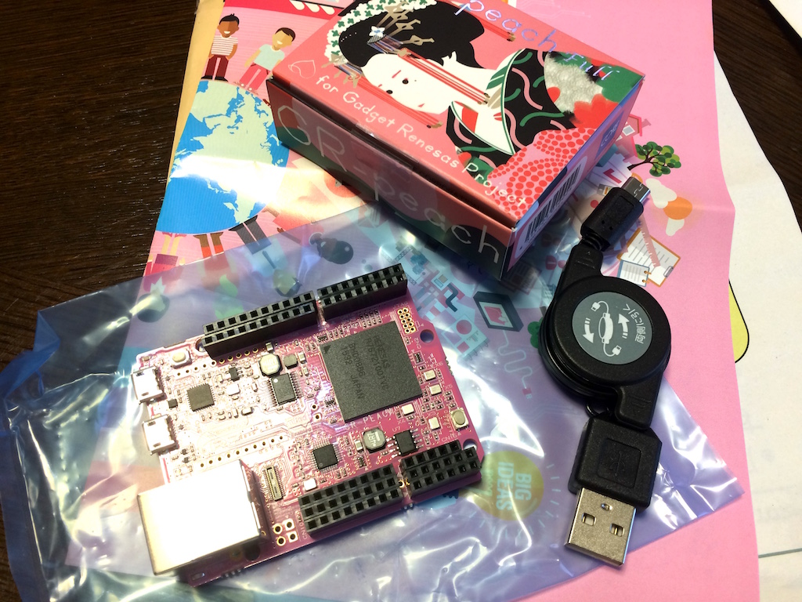

## GR-peachで遊んでみたときのメモ


### これはなに？
- セキュリティキャンプ2016の「7-B：組込みリアルタイムOSとIoTシステム演習」でもらった！
- mbed対応のボード

### Macでシリアルコンソールを読む
```
ls /dev/tty.usbmodem*
```
でttyを特定し（仮に`/dev/tty.usbmodem1422`とする）
```
screen /dev/tty.usbmodem1422 115200
```
で開く．`Ctrl-A k`でscreenを切断できる．

このシリアルコンソールに，syslogの出力が出るので，デバッグやIPの確認に使える．
